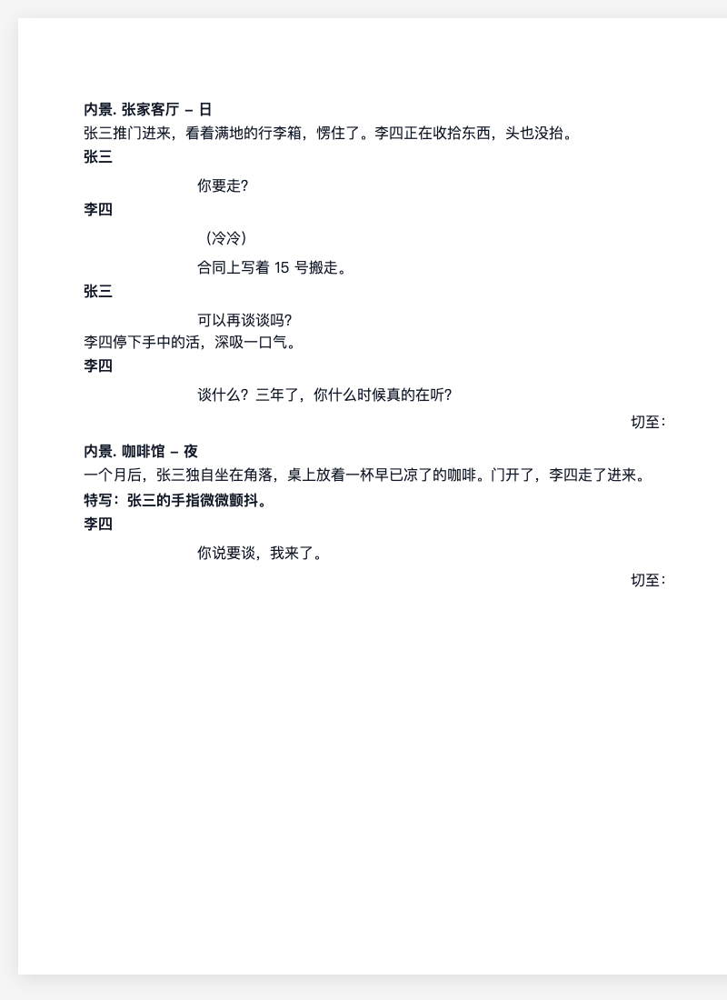
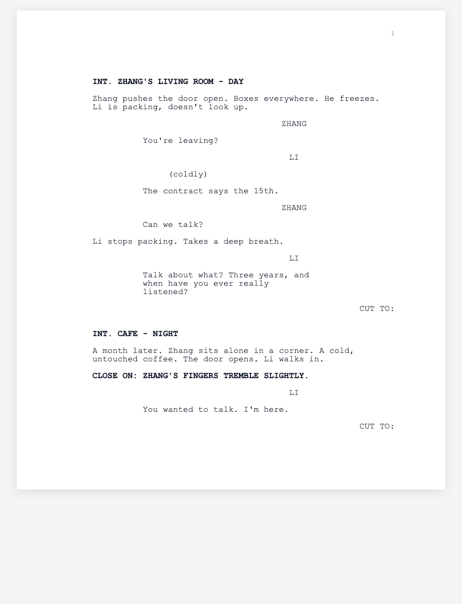
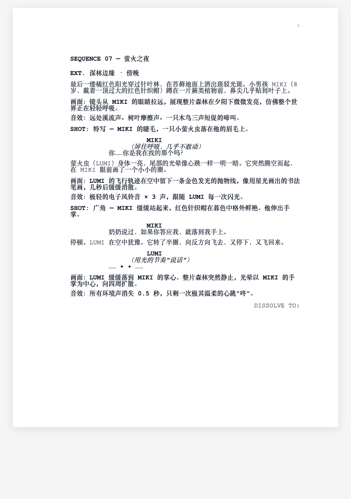
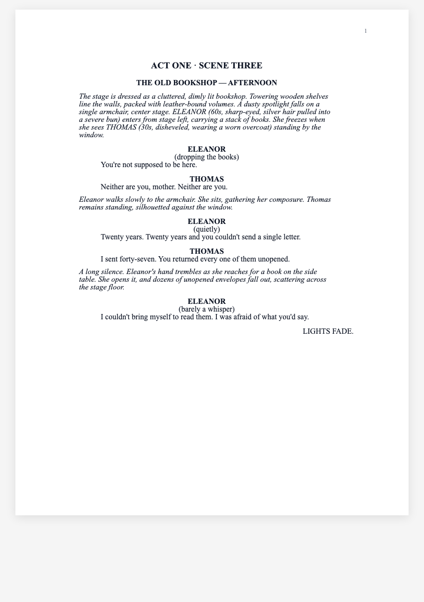
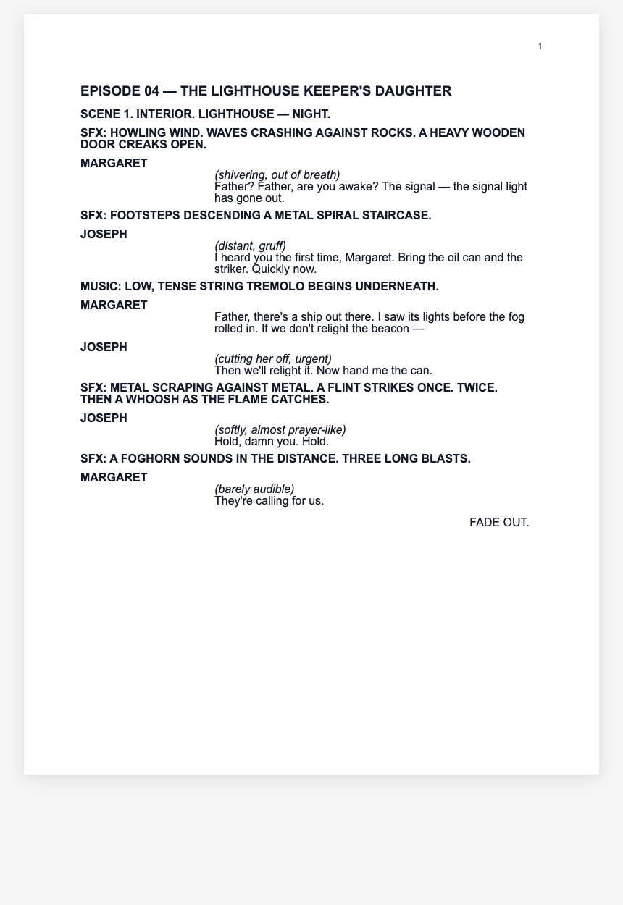

# 🎬 Screenplay Writer

> 给 AI 用的工业级剧本规范手册 —— AI 读完可以直接产出符合行业标准的 Word / PDF 剧本文件

---

## 这是什么

**Screenplay Writer** 是一个为 AI 编程助手（Codex / Claude Code / MiniMax Code 等）设计的 Skill。

它的定位跟别的 Skill 不一样：

> **它不是给你（人）看规则的手册，而是给 AI 用的工业级规范。AI 读完后能自己按行业标准生成 Word / PDF 剧本文件，字体、字号、边距、缩进、大小写、加粗、斜体、分页全部精确对齐 Final Draft。**

## 为什么需要它

剧本行业跟别的文档不一样，**格式本身就是行业硬性标准**：

- 好莱坞剧本用 Courier 12pt，左边距 1.5"，右上角页码
- 中国大陆影视剧用 A4 + Microsoft YaHei + 特定行距
- 舞台剧场景标题必须居中大写加粗，动作描写必须斜体
- 每一类元素（场景 / 动作 / 角色 / 括号 / 对白 / 转场 / 镜头）的缩进、对齐、大小写规则严格不同

普通 AI 给你生成的剧本 Word / PDF 通常**排版全错**——因为它不知道这些行业标准。这个 Skill 就是**把行业标准直接封装成 AI 可以按参数照抄的规范手册**，AI 读完就能出专业剧本文件。

## 工作原理

**核心思路：3 Mode 分层 + 工业级排版参数 → Word/PDF 输出**

```
用户扔剧本给 AI
   ↓
AI 触发 screenplay-writer Skill
   ↓
Skill 加载 3 Mode 规范 + 4 种格式的精确排版参数
   ↓
AI 按参数生成 Word (.docx) 或 PDF (.pdf) 文件
   ↓
文件直接发给用户（可打印、可提交、可发行）
```

**关键理解**：用户全程只跟 AI 对话，看到的最终产出是**可以直接双击打开、微调、打印的 Word/PDF 文件**，不是 Markdown 中间态。

## 3 种使用模式

### 1️⃣ Mode 1: 格式转换 → 输出 Word / PDF

**你在用**：Word / 记事本随手写的剧本，想改成标准好莱坞 / 东亚 / 舞台剧 / 广播剧 / 动画剧本格式的**可发行 Word 或 PDF 文件**

**Skill 做什么**：
- 识别现有格式（好莱坞 / 东亚 / 舞台剧 / 广播剧 / 动画剧本 / 无格式）
- 逐行归类元素（场景 / 动作 / 角色 / 括号 / 对白 / 转场 / 镜头 / 章节 / 备注）
- 按目标格式的**完整工业规范**生成 Word 或 PDF 文件
- 直接把文件发给你

**支持 5 种目标格式**（工业级参数完全对齐 Final Draft 标准）：

| 格式 | 纸张 | 字体 | 边距 | 特色 |
|------|------|------|------|------|
| **好莱坞标准** | Letter | Courier New 12pt | 上下右 1" / **左 1.5"** | 场景 / 角色 / 转场全大写，54 行/页 |
| **东亚影视** | A4 | Microsoft YaHei 12pt | 各边约 72-76px | 场景加粗，中文行距，无大写概念 |
| **舞台剧** | Letter | Times New Roman 12pt | 各边 86-92px | 场景居中大写加粗，动作斜体 |
| **广播剧/播客** | A4 | Arial 12pt | 各边 78px | 角色加粗大写，括号内演绎提示斜体 |
| **动画剧本** | Letter | Courier New 12pt + 宋体降级 | 上下右 1" / 左 1.5" | 好莱坞页面 + `VISUAL:` / `SFX:` 元素，分镜师和音效师一眼定位，对齐迪士尼/Pixar 动画剧本传统 |

**输出文件**（4 选 1 或多选）：

| 文件类型 | 用途 | 谁能打开继续编辑 |
|---------|------|--------------|
| **`.docx` Word** | 打印 / 团队协作 / 通用编辑 | Word / WPS / Google Docs |
| **`.pdf` PDF** | 打印 / 存档 / 发行提交 | 任何 PDF 阅读器（只读为主） |
| **`.fountain` Fountain** | 用剧本编辑器继续深度编辑 | **Highland / Slugline / Fade In / Beat / KIT Scenarist** |
| **`.fdx` Final Draft XML** | 好莱坞行业标准交付格式 | **Final Draft / Fade In / Movie Magic / Highland / KIT Scenarist** |

### 2️⃣ Mode 2: 术语优化

**你在用**：剧本已经写完，想让术语规范一下

**Skill 做什么**：
- 扫描全文，找到所有**场景标题** / **转场词** / **时间术语** / **括号提示**
- 按目标语言映射到规范词典（中文 / 英文 / 繁中 / 日文 / 韩文）
- 询问是否要导出成 Word/PDF

### 3️⃣ Mode 3: 结构重塑

**你在用**：剧本节奏散、结构乱，想按经典叙事模板重组

**Skill 做什么**：
- 分析现有故事的场次和节拍点
- 对齐目标结构模板（三幕式 / 救猫咪 / 英雄旅程 / 起承转合 / TV Hour）
- 输出**结构诊断报告**，可选择让 Skill 直接重排场次
- 询问是否要导出成 Word 大纲

**铁律**：Skill 只做结构层面的建议，**不代写具体剧情**。

## 安装

将 `screenplay-writer` 文件夹放到你的 Skill 目录：

```bash
# Codex
~/.codex/skills/screenplay-writer

# MiniMax Code (Mavis)
~/.mavis/skills/screenplay-writer
```

**依赖**（Word/PDF 导出用）：
```bash
pip install python-docx        # Word 导出
pip install weasyprint         # PDF 导出（推荐，无需浏览器）
# 或
pip install playwright         # PDF 导出（用 Chromium）
```

目录结构：

```
screenplay-writer/
├── SKILL.md                                # 主入口（3 Mode 路由 + 触发判定）
└── references/
    ├── mode-1-format-conversion.md         # Mode 1: 格式转换
    ├── mode-2-term-refinement.md           # Mode 2: 术语优化
    ├── mode-3-structure-reshape.md         # Mode 3: 结构重塑
    ├── vocab-scene-terms.md                # 共享词典 · 内外景 + 时间术语
    ├── vocab-transitions.md                # 共享词典 · 9 种转场词（5 语言）
    ├── vocab-format-specs.md               # 🎯 5 种剧本格式的工业级精确排版参数
    ├── export-to-docx.md                   # 🎯 Word 导出模板 + python-docx 代码
    ├── export-to-pdf.md                    # 🎯 PDF 导出模板 + CSS + Playwright/WeasyPrint 代码
    ├── export-to-fountain.md               # 🎯 Fountain 导出（可入 Highland/Slugline/Fade In）
    └── export-to-fdx.md                    # 🎯 FDX 导出（可入 Final Draft/Movie Magic）
```

## 使用方法

### 场景 1：让 AI 直接生成好莱坞标准 Word

```
$screenplay-writer 我这份剧本是 Word 粘过来的，帮我转成好莱坞标准 Word 文件
[粘贴剧本文本]
```

AI 会：
1. 触发 Mode 1
2. 加载 `vocab-format-specs.md` 里好莱坞的完整参数（Courier 12pt / 左 1.5" / 54 行/页 / 元素缩进）
3. 加载 `export-to-docx.md` 里的 python-docx 生成代码
4. 生成 `.docx` 文件
5. 用 `<media type="file" src="/output.docx" />` 发给你

你收到的是一个真实 Word 文件，双击打开，跟 Final Draft 导出的效果同级。

### 场景 2：让 AI 生成东亚剧本 PDF

```
$screenplay-writer 帮我把这份剧本做成 A4 版本的 PDF，中文标准格式
[粘贴剧本]
```

AI 会生成一个 `.pdf` 文件，A4 + Microsoft YaHei + 中文行距，直接可以打印。

### 场景 3：结构重塑 → 输出 Word 大纲

```
$screenplay-writer 按救猫咪 15 拍分析我这个故事，然后帮我做成 Word 大纲
[粘贴故事梗概]
```

AI 会：
1. 触发 Mode 3
2. 分析故事节拍点
3. 输出结构诊断报告
4. 询问是否要导出
5. 生成 Word 版本的场次大纲，含每个节拍对应的场次编号 + 内容简述

### 场景 4：3 Mode 叠加使用

```
$screenplay-writer 先按三幕式重组我这个故事（Mode 3），
然后把我补齐后的剧本内容转成好莱坞标准 Word（Mode 1）
```

AI 按顺序执行 Mode 3 + Mode 1，最终交付一份符合好莱坞标准的 Word 文件。

### 场景 5：导入剧本编辑器继续深度编辑

```
$screenplay-writer 帮我把这份剧本转成 Fountain 文件，我要在 Highland 里继续改
[粘贴剧本]
```

AI 生成 `.fountain` 文件（含完整标题页 metadata + 中文场景/角色/转场的强制标记），你双击就能在 Highland / Slugline / Fade In / Beat / KIT Scenarist 里打开继续编辑。

```
$screenplay-writer 我要给制片公司发 Final Draft 文件
[粘贴剧本]
```

AI 生成符合 Final Draft XML 规范的 `.fdx` 文件，可以直接双击用 Final Draft / Movie Magic 打开。

---

## 完整发行流程（真实场景演示）

**用户目标**：写一部短剧本，最终要发行到好莱坞市场

```
Step 1: 用户扔给 AI 一份散文式草稿
   ↓
Step 2: $screenplay-writer 按救猫咪 15 拍分析和重组结构（Mode 3）
   → AI 输出结构诊断报告 + 场次重排建议
   ↓
Step 3: 用户按建议补齐场次内容
   ↓
Step 4: $screenplay-writer 帮我规范术语，英文版（Mode 2）
   → AI 把中文场景/时间/转场统一映射到英文规范
   ↓
Step 5: $screenplay-writer 帮我导出好莱坞标准 Word（Mode 1 → .docx）
   → AI 生成 .docx 文件，用户在 Word 里做最后微调
   ↓
Step 6: $screenplay-writer 生成 FDX 交付版本（Mode 1 → .fdx）
   → AI 生成 .fdx 文件，用户或制片公司可以直接用 Final Draft 打开
   ↓
Step 7: $screenplay-writer 同时导出 PDF 打印版（Mode 1 → .pdf）
   → AI 生成 .pdf 文件，用户打印一份纸质版
```

**最终交付物**：`.docx` + `.pdf` + `.fdx` 三份文件，涵盖内部协作 / 打印 / 制片提交所有场景。

**跨编辑器切换**：如果用户中途想换编辑器，只需重新导出对应格式：
- 想在 Highland 里改 → 导出 `.fountain`
- 想切回 Final Draft 或者用 Fade In → 导出 `.fdx`
- 中文合作方要 Word → 导出东亚格式 `.docx`

---

## 实战案例：跑一遍 3 个 Mode

以下用一段**完全没格式的散文式剧本**作为原始输入，展示 Skill 的处理效果。

### 📝 原始剧本（用户随手写的散文，无任何格式）

```
1. 张家客厅，白天。
张三推门进来，看着满地的行李箱，愣住了。
李四正在收拾东西，头也没抬。
张三：你要走？
李四：（冷冷地）合同上写着 15 号搬走。
张三：可以再谈谈吗？
李四停下手中的活，深吸一口气。
李四：谈什么？三年了，你什么时候真的在听？
画面切换。

2. 咖啡馆，室内，晚上。
一个月后，张三独自坐在角落，桌上放着一杯早已凉了的咖啡。
门开了，李四走了进来。
镜头特写：张三的手指微微颤抖。
李四：你说要谈，我来了。
Cut to：
```

**问题诊断**：场景标题不统一、转场词混乱、角色名和对白混在一行、括号提示写法不标准、`镜头特写：` 其实是 shot 元素

---

### 🀄 生成东亚剧本 Word

**触发**：`$screenplay-writer 帮我把这段做成 A4 中文标准 Word 剧本`

**AI 内部处理**（用户看不见）：
- 识别每行元素类型
- 按 `vocab-format-specs.md` 加载东亚格式参数：
  - 页面：A4（794×1123 px）+ 边距 76/72/76/72 px
  - 字体：Microsoft YaHei 12pt，行高 16px
  - 场景元素：宽 650 px、左对齐、段前 16 px、段后 10 px、**加粗**
  - 角色元素：宽 120 px、**加粗**、段前 10 px
  - 对白元素：**左缩进 125 px**、宽 470 px、段后 8 px
  - 括号元素：左缩进 125 px、宽 410 px
  - 转场元素：左缩进 470 px、宽 180 px、**右对齐**
- 调用 python-docx 生成 `.docx`
- 页码放右上角 9pt 灰色

**用户收到**：`张三李四.docx` 文件（Word 双击打开）

**实际输出效果**（Skill 按规范渲染出来的样子）：



**改动说明**：
- ✅ 场景标题规范化 + 加粗
- ✅ 角色名单独一行 + 加粗
- ✅ 括号提示 + 对白按 125 px 左缩进
- ✅ 转场统一 + 右对齐
- ✅ 识别出 `镜头特写：` 是 shot 元素
- ✅ 页码右上角

### 🎬 生成好莱坞剧本 PDF

**触发**：`$screenplay-writer 帮我把这段转成好莱坞标准 PDF，英文版`

**AI 内部处理**：
- 触发 Mode 2 先做术语英化（内景 → INT. / 日 → DAY / 切至 → CUT TO:）
- 加载好莱坞格式参数：Letter + 左 1.5"（**重点**）+ Courier 12pt
- 加载 `export-to-pdf.md` 里的 CSS 模板
- 生成 HTML → 用 WeasyPrint 转 PDF

**用户收到**：`zhang-li.pdf`（打开是符合行业标准的英文剧本）

**实际输出效果**（Skill 按规范渲染出来的样子）：



**改动说明**：
- ✅ Letter 纸 + 左边距 1.5"（好莱坞黄金标准）
- ✅ Courier 12pt 等宽字体（好莱坞行业标准字体）
- ✅ 场景 / 角色名 / 转场词全大写
- ✅ 角色名居中（左缩进 211 px）
- ✅ 对白左缩进 96 px、宽 336 px
- ✅ 转场靠右对齐、加粗大写
- ✅ 页码右上角

### 🎨 生成动画剧本 PDF

**触发**：`$screenplay-writer 帮我把这段动画分场做成标准动画剧本 PDF`

**AI 内部处理**：
- 识别原文含 `画面：` / `音效：` / `SHOT:` 等标签 → 判定为动画剧本
- 加载动画格式参数：Letter + 左 1.5" + Arial 12pt + 内容宽 576 px
- 加载 `export-to-pdf.md` 里动画格式 CSS 模板（含 `.visual` / `.sfx` 特有元素）
- 生成 HTML → 用 WeasyPrint 转 PDF

**用户收到**：`animation-screenplay.pdf`（打开是符合行业标准的动画剧本）

**实际输出效果**（Skill 按规范渲染出来的样子）：



**改动说明**：
- ✅ Letter 纸 + 左边距 1.5"（沿用好莱坞页面规范）
- ✅ **Courier New 12pt + 宋体降级**（严格对齐迪士尼/Pixar 动画剧本传统，等宽打字机风+中文衬线宋体）
- ✅ 场景 / 角色 / 转场 / SHOT 全大写加粗
- ✅ **新增 `VISUAL:` 元素** — 大写加粗，供分镜师定位关键画面
- ✅ **新增 `SFX:` 元素** — 大写加粗，供音效师定位音效点
- ✅ `SHOT:` 强制大写加粗（动画每个镜头单独渲染，需醒目定位）
- ✅ 括号内演绎提示 `（低声）` / `（用光的节奏"说话"）` 用斜体
- ✅ 严格黑白单色打印（对齐动画业界内部剧本惯例）
- ✅ 支持非人类角色的超现实"对白"（如萤火虫用光节奏说话）

### 🎭 生成舞台剧 PDF

**触发**：`$screenplay-writer 帮我把这段做成标准舞台剧格式 PDF`

**AI 内部处理**：
- 识别原文含 `stage direction` / `enters from stage left` / `LIGHTS FADE` 等标记 → 判定为舞台剧
- 加载舞台剧格式参数：Letter + Times New Roman 12pt + 场景居中大写、动作斜体
- 加载 `export-to-pdf.md` 里舞台剧 CSS 模板
- 生成 HTML → 用 WeasyPrint 转 PDF

**用户收到**：`stage-play.pdf`（打开是符合国际舞台剧行业标准的剧本）

**实际输出效果**：



**改动说明**：
- ✅ Letter 纸 + 上下 88px / 左 92px / 右 86px（Samuel French / Dramatists Play Service 出版模板参数）
- ✅ **Times New Roman 12pt + 宋体降级**（衬线体，舞台剧行业惯例，印刷正式感）
- ✅ 场景标题 **居中 + 大写 + 加粗**（如 `THE OLD BOOKSHOP — AFTERNOON`）
- ✅ **动作描写用斜体**（跟对白视觉区分，舞台剧最独特的规范）
- ✅ **舞台方向语言**（`stage left` / `center stage` / `enters from`）
- ✅ 角色名居中大写加粗
- ✅ 转场用 `LIGHTS FADE.` / `BLACKOUT.` 等舞台专属转场词
- ✅ 详细描述舞台布置（针叶木书架、聚光灯位置）—— 真人电影剧本不会写这么细

### 📻 生成广播剧 PDF

**触发**：`$screenplay-writer 帮我把这段做成标准广播剧格式 PDF`

**AI 内部处理**：
- 识别原文含 `SFX:` / `MUSIC:` / `(distant, gruff)` 等标记 → 判定为广播剧
- 加载广播剧格式参数：A4 + Arial 12pt + 角色名加粗大写 + 音效标签独立
- 加载 `export-to-pdf.md` 里广播剧 CSS 模板
- 生成 HTML → 用 WeasyPrint 转 PDF

**用户收到**：`audio-drama.pdf`（打开是符合 BBC / NPR 广播剧格式的剧本）

**实际输出效果**：



**改动说明**：
- ✅ A4 纸 + 各边 78px（BBC Writersroom 参考参数）
- ✅ **Arial 12pt 无衬线体**（配音演员快速扫读，屏幕友好）
- ✅ 角色名**独立成段 + 加粗大写**（配音演员一眼定位自己的台词）
- ✅ **括号内演绎提示斜体**（`(shivering, out of breath)`、`(barely audible)` 给配音演员的情绪指引）
- ✅ **`SFX:` 音效指令独立成段大写**（音效师快速定位）
- ✅ **`MUSIC:` 音乐指令独立标签**（跟音效分开，方便配乐师）
- ✅ 每场对话量控制在 1 分钟音频以内

### 🔤 Mode 2 案例：只做术语规范化

**触发**：`$screenplay-writer 帮我把这段术语统一成简体中文规范，不用导出文件`

**AI 输出术语优化报告**：

| # | 类型 | 原文 | 规范后 |
|---|------|------|--------|
| 1 | 场景标题 | `1. 张家客厅，白天。` | `内景. 张家客厅 - 日` |
| 2 | 场景标题 | `2. 咖啡馆，室内，晚上。` | `内景. 咖啡馆 - 夜` |
| 3 | 转场词 | `画面切换。` | `切至：` |
| 4 | 转场词 | `Cut to：` | `切至：` |
| 5 | 镜头 | `镜头特写：` | `特写：` |
| 6 | 括号提示 | `（冷冷地）` | `（冷冷）` |

**说明**：Mode 2 只改术语，剧情一个字没动。

### 🏗️ Mode 3 案例：按三幕式分析

**触发**：`$screenplay-writer 我这个故事就 2 场戏，感觉不完整，帮我按三幕式分析`

**AI 输出**（节选）：

```markdown
## 结构诊断报告

**目标结构**：三幕式（8 拍）
**现有场次数**：2 → 建议 40-60

⚠️ 场次严重不足。仅覆盖 2-3 个节拍。

### 节拍对齐表
| # | 节拍 | 你的对应场次 | 状态 |
|---|------|------------|------|
| 1 | 开场状态 | 无 | ❌ 缺失 |
| 2 | 诱发事件 | Sc.1 | ✅ 到位 |
| 3 | 第一幕转折 | 无 | ❌ 缺失 |
| 4 | 中点反转 | Sc.2？ | ⚠️ 位置问题 |
| 5-8 | 危机/转折/高潮/余波 | 无 | ❌ 缺失 |

### 建议补齐
1. 开场状态：铺垫日常关系（2 场）
2. 第一幕转折：张三接受现实（3 场）
3. 中点前铺垫：张三独自生活 + 试图联系（8 场）
4. ...（后续建议）
```

**铁律提醒**：Skill 不代写具体台词，只做结构层面的建议。

---

## 三个 Mode 的定位对比

| Mode | 原文改动幅度 | 最终产物 |
|------|--------------|--------|
| **Mode 1** | 只改布局，字数几乎不变 | 📄 **Word / PDF 剧本文件** |
| **Mode 2** | 只改术语，剧情不动 | 📝 术语优化报告 + 可选 Word/PDF |
| **Mode 3** | 结构大改（用户填充） | 📋 结构诊断报告 + 可选 Word 大纲 |

**建议顺序**（3 个都要用时）：
1. 先 Mode 3 定结构骨架
2. 自己补齐每场戏具体内容
3. Mode 2 规范术语
4. Mode 1 转成目标发行 Word / PDF

## 核心原则

| 原则 | 说明 |
| --- | --- |
| 🎯 **工业级参数** | 严格对齐 Final Draft 行业标准的所有排版参数 |
| 📄 **直接产出 Word/PDF** | 不给用户看 Markdown 中间态，直接给可用文件 |
| 🌐 **5 语言无缝** | 简中 / 英 / 繁中 / 日 / 韩 之间自由互转 |
| 📝 **不代写剧情** | Mode 3 只做结构建议，具体台词/情节由用户构思 |
| ✅ **Before/After 对照** | 每次改动都给用户看差异 |
| 🚫 **保留原文本身** | 专有名词、人名、地名一律保留 |

## Skill 边界

**做**：
- ✅ 生成符合行业标准的 Word / PDF 剧本文件
- ✅ 术语规范（词典替换）
- ✅ 结构分析和重组建议
- ✅ FDX / Fountain 导入导出

**不做**：
- ❌ **不写具体剧情内容**
- ❌ **不给剧本打分/评优**
- ❌ **不做人物弧线设计 / 对话生成**

## 参考

**行业格式标准**：

- **好莱坞（Hollywood）**：WGA 美国编剧工会规范 / Final Draft 默认模板
  - [SCREENPLAY FORMAT 剧本格式 · 知乎](https://zhuanlan.zhihu.com/p/66593253)
    （本 Skill 里好莱坞格式的 4 组核心缩进值 —— Character 2.0" / Parenthetical 1.5" / Dialogue 1.0" / Transition 4.0" —— 直接来自此教程引用的行业公开规范）
  - 页面：Letter 8.5" × 11"，上/下/右 1"，左 1.5"（用于装订）
  - 字体：Courier 12pt，单倍行距，约 54 行/页
  - 一页正文约等于一分钟屏幕时间

- **东亚影视（East Asia）**：中国大陆无强制统一规范，通用惯例来自各大制作公司与影视院校教材
  - 一集 40 分钟 ≈ 30-40 场戏、约 12000 字
  - 场次头结构：`场次号 + 时(日/夜) + 景(内/外) + 人`
  - 纸张：A4，字体：宋体 / 黑体 / 楷体 12pt
  - 大陆写法接近小说体（直接描述动作与对话），港台常用符号标记

- **舞台剧（Stage）**：[Australian Script Centre - Script Format Example](https://australianscriptcentre.com.au/) / Samuel French / Dramatists Play Service 出版模板
  - 动作描写用**斜体**（跟对白视觉区分）
  - 角色名 UPPERCASE 加粗居中
  - 场景说明详细描述舞台布置（不像电影那样只描写发生的动作）
  - 有 ACT + SCENE 双层划分

- **广播剧 / 播客（Audio）**：[BBC Writersroom - Script Format](https://www.bbc.co.uk/writersroom/preparing-your-script) / NPR 播客剧本内部指南
  - 角色名全大写加粗（配音演员快速定位）
  - 音效指令用大写标签（`SFX:` / `MUSIC:` / `(DOOR SLAMS)`）
  - 括号内演绎提示用斜体（区分动作与对白）
  - 每页对话量控制在 1 分钟音频以内

- **动画剧本（Animation）**：动画业界惯例 / [《动画剧本格式》公开教程（豆丁网 / 道客巴巴）](https://www.doc88.com/p-2595612998139.html) / Pixar & Disney & Cartoon Network 内部剧本模板
  - **围绕分镜画面写**，剧本分"文学剧本 + 文字剧本"两层
  - 页面沿用好莱坞标准（Letter / 左 1.5" / 12pt）
  - 新增 `VISUAL:` / `画面：` 元素，供分镜师定位关键画面
  - 新增 `SFX:` / `音效：` 元素，供音效师定位音效点
  - `shot` 元素强制大写加粗（动画每个镜头都要单独渲染）
  - 场景描述允许超现实描写（不用像真人剧本考虑实拍成本）

- Fountain 语法规范：https://fountain.io/syntax
- Save the Cat（救猫咪）15 拍：Blake Snyder 原著
- Hero's Journey：Joseph Campbell 单一神话论
- FDX 格式：Final Draft XML 官方规范

**技术库**：
- python-docx：https://python-docx.readthedocs.io/
- WeasyPrint：https://weasyprint.org/
- Playwright：https://playwright.dev/

## License

MIT
